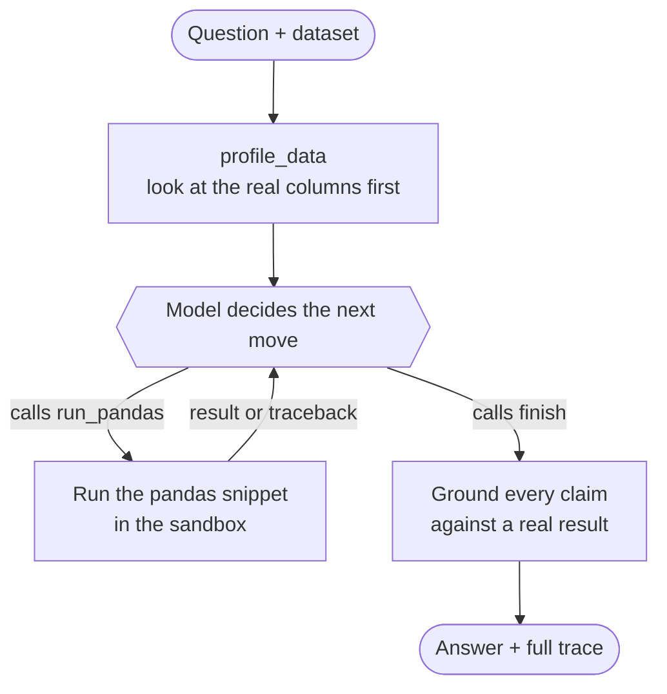
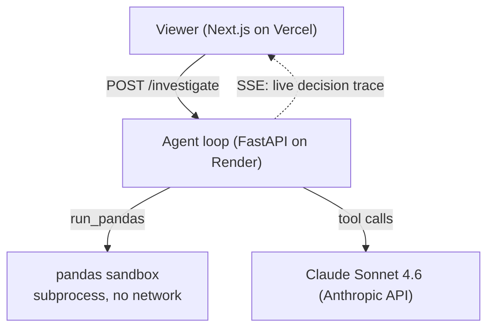

# Data Investigator


**An autonomous data-analysis agent that investigates a dataset one question at a time, choosing each step from what the previous result showed.**

🔗 **Live demo: https://investigator.natebowers.dev/investigator**

I built Data Investigator to show I can build an agent end to end. The core is a loop I wrote by hand over the Anthropic Messages API, not a framework's agent runner. You give it a dataset and a question like *"why did signups drop in March?"*, and it works the problem: it writes a pandas snippet, runs it in a sandbox, reads the result, picks what to check next, fixes its own broken queries, and stops once it can answer. Every step streams to the UI as it happens.

The investigation path is not scripted. The model chooses each step at runtime from the previous result. The UI shows that directly: the tools the agent can call, the columns it is looking at, and each tool call as it streams in.

---

## The agent loop

The core is a hand-written `while` loop, not the SDK's tool-runner or a managed-agent service. Each turn it asks the model what to do, runs the tool the model chose, feeds the result back, and repeats until the model calls `finish`.



The only forced step is the first one, `profile_data`, so the agent sees the real schema before it forms a hypothesis and never references a column that does not exist. After that, `tool_choice` is `auto` and the model drives. When a snippet raises, the sandbox returns the traceback as a tool result with `is_error: true`, and the model reads it and rewrites the query.

---

## Anatomy of a run

A real run on the demo dataset (*"why did signups drop in March?"*), showing the path the model chose:

```
① profile_data      → sees signup_date / campaign_id / activated are strings, 2,224 rows
② run_pandas        → monthly totals … ValueError: date "unknown" won't parse
   └─ self-corrects → re-runs with errors='coerce' → confirms the March dip
③ run_pandas        → signups by channel × month … only `social` collapses in March
④ run_pandas        → social by campaign_id … cmp_social_2024 is absent all March
⑤ run_pandas + bar  → weekly social signups, Feb vs Mar → chart shows a hard stop
⑥ finish            → "the social campaign was paused": 6 findings, each grounded
```

It hit a broken date parse and fixed itself (②), then went from total to channel to campaign because each result pointed there, drew a chart, and stopped once the causal chain held. A committed recording of this run replays on the live page when the free backend is asleep.

---

## Architecture

Split hosting: a static viewer on Vercel, the CPU-bound agent and sandbox on an always-on Python host, and the model behind an API.



The backend streams its decision log as step-level Server-Sent Events. The UI renders that same stream live, and it is what I would debug from. There is no separate logging pass.

---

## Sandbox

- The agent's pandas runs in an isolated, resource-limited subprocess with no network, so a bad snippet cannot reach the server.

---

## Reliability and cost

- Runs on your own Anthropic API key.
- The public endpoint is rate-limited.

---

## Next steps

This is a single agent. The next step is to turn it into a small orchestration project: a coordinator that fans out several investigator agents and combines their findings.

---

## Tech stack

- **Backend:** Python, FastAPI, the Anthropic SDK (Claude Sonnet 4.6), pandas. Deployed on Render.
- **Frontend:** Next.js, React, TypeScript. Deployed on Vercel.

---

## Run it locally

```bash
# Backend
cd agent
python3 -m venv .venv && source .venv/bin/activate
pip install -r requirements.txt
cp .env.example .env                # add your ANTHROPIC_API_KEY
python data/generate_signups.py     # (re)build the demo dataset
uvicorn app.main:app --reload

# Frontend (separate terminal)
cd web
npm install
cp .env.local.example .env.local    # NEXT_PUBLIC_BACKEND_URL=http://localhost:8000
npm run dev                          # http://localhost:3000/investigator
```

Tests: `cd agent && python -m pytest` covers sandbox isolation, the mocked agent loop, and the rate limiter.

---

## Project layout

```
agent/            Python backend
  app/loop.py       the hand-written agent loop
  app/tools.py      the 3 tool schemas the model sees
  app/sandbox.py    isolated pandas execution
  app/grounding.py  "no result, no claim"
  data/             the demo dataset and its seeder
web/              Next.js viewer
  lib/investigator/         events, reducer, and the live/replay hook
  components/investigator/  the context panel, step cards, loop meter, report
  public/recordings/        the committed recorded run, used as a fallback
docs/             how-the-loop-works.md
```
