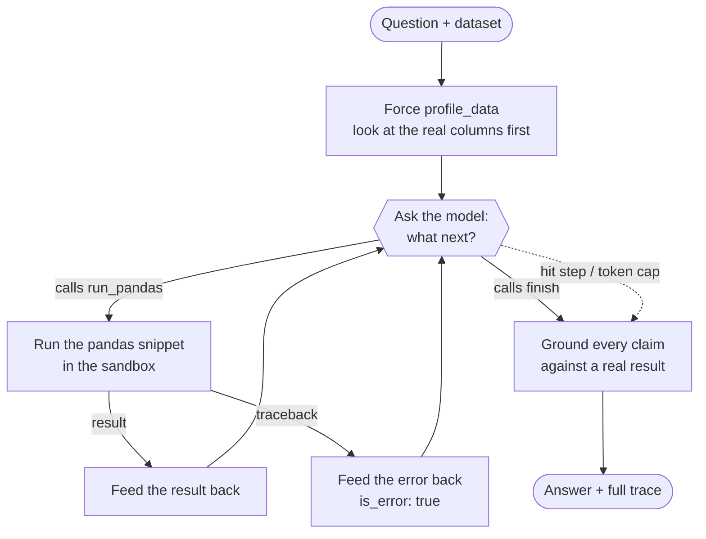
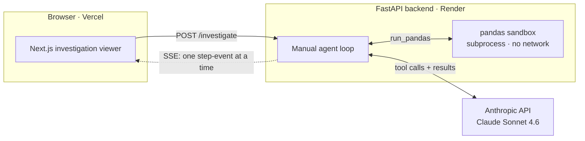

# Data Investigator

**A data-analysis agent that investigates a dataset the way a person would — one question at a time, deciding each step from what the last one revealed.**

🔗 **Live demo → https://web-mu-three-lu56la822j.vercel.app/investigator**

I built Data Investigator to show what *agent orchestration* actually looks like under the hood — not a single prompt that returns an answer, but a real loop where a language model writes its own pandas, runs it in a sandbox, reads the result, and decides its next move. You hand it a dataset and an investigative question like *"why did signups drop in March?"* and you **watch it think**: hypothesize → run code → read the result → follow the lead → fix its own broken query → stop when it actually has the answer.

**Nothing about the path is hardcoded. The data drives it.** That's the whole point — and the UI is built to make it visible: you see the tools the agent can call, the data it's looking at, and every tool call streaming in as `calls run_pandas → input → returned`.

---

## What it demonstrates

Every run visibly shows the four things that separate a real **agent** from a scripted **workflow**:

| | |
|---|---|
| **Runtime tool choice** | the model decides what to compute next — there is no fixed sequence |
| **A real loop** | each step's result feeds the next decision |
| **Self-termination** | it decides when it has answered (and I can prove it wasn't a counter) |
| **Reliability under mess** | a broken query is caught, the traceback is fed back, and it rewrites its own code |

---

## The agent loop

The core is a hand-written loop, not the SDK's tool-runner and not a managed-agent service — because the loop *is* the project, and I wanted it legible. It's a `while` loop: ask the model what to do, run whatever tool it asked for, feed the result back, repeat until it calls `finish`.



The only thing I force is the very first move — `profile_data`, so the agent looks at the real schema before it hypothesizes and never invents a column. After that, `tool_choice` is `auto` and the model is on its own. **Delete every `if step ==` line in the loop and it's still an agent** — those lines are only the first-step nudge and the safety caps.

---

## Anatomy of a run

Here's an actual run on the demo dataset (*"why did signups drop in March?"*) — the reasoning path the agent chose, entirely on its own:

```
① profile_data      → sees signup_date / campaign_id / activated are strings, 2,224 rows
② run_pandas        → monthly totals … ValueError: date "unknown" won't parse
   └─ self-corrects → re-runs with errors='coerce' → confirms the March dip
③ run_pandas        → signups by channel × month … only `social` collapses in March
④ run_pandas        → social by campaign_id … cmp_social_2024 is absent all March
⑤ run_pandas + bar  → weekly social signups, Feb vs Mar → chart shows a hard stop
⑥ finish            → "the social campaign was paused" — 6 findings, each grounded
```

It hit a broken date parse and fixed itself (②), branched from *total* to *channel* to *campaign* because each result pointed there, **chose** to draw a chart, and stopped once the causal chain held. A committed recording of this exact run replays on the live page even when the backend is asleep.

---

## Architecture

Split hosting: a static viewer on Vercel, the CPU-bound agent + sandbox on an always-on Python host, the model behind an API.



The backend streams its **decision log** as step-level Server-Sent Events — the same stream the UI renders live and the thing I'd debug from. There's no separate logging pass; the trace *is* the log.

---

## Running LLM-written code safely (the sandbox)

The agent writes and runs its own pandas — including over an uploaded CSV — so the sandbox is the real risk surface, and I built it first:

- **Subprocess isolation** — a bad snippet dies as a child; the web server is never touched.
- **Resource limits** — `RLIMIT_CPU` + `RLIMIT_AS` (floored so numpy still imports on Linux) + a wall-clock timeout that `killpg`s the whole process group.
- **No network** — `unshare -n` on Linux plus an in-process socket guard everywhere.
- **Bounded output, verbatim tracebacks** — big frames are summarized to a head + shape; errors come back *whole*, which is exactly the fuel the self-correction loop needs.

The dataset is passed by path; the data itself never crosses into the request body. Swapping the subprocess for a locked-down container is a one-file change behind the same `run_pandas` contract.

---

## Reliability & cost

Things I built in from the start, not bolted on:

- **Grounding** — every claim in the final report must reference a step that produced a real result. Enforced in code (`grounding.py`), not just asked for in the prompt; a broken evidence link renders as broken in the UI.
- **Loop cap + token budget** — checked before every model call, so a run can't spiral or overspend.
- **Self-correction** — a sandbox error returns the traceback as a `tool_result` with `is_error: true`; the model reads it and rewrites, capped per-step so a hopeless snippet can't loop forever.
- **Prompt caching** — one cache breakpoint follows the growing conversation prefix, so tools + system + prior turns are re-read at ~0.1×. Roughly halves the cost of a run with zero quality change.
- **Rate limiting** — the public `/investigate` endpoint is capped per-IP and globally per day (returns `429` before any tokens are spent), with an Anthropic Console spend cap as the hard backstop.

---

## Tech stack

- **Backend** — Python 3.12, FastAPI, the Anthropic Python SDK (Claude **Sonnet 4.6**), pandas, matplotlib. A hand-written agentic loop; a subprocess sandbox. Deployed on **Render**.
- **Frontend** — Next.js 15 (App Router) + React 19 + TypeScript. One reducer renders both live runs and the recorded run. Deployed on **Vercel**.
- **Design notes** — a fuller writeup of how the loop works lives in [`docs/how-the-loop-works.md`](docs/how-the-loop-works.md).

---

## Run it locally

```bash
# Backend
cd agent
python3 -m venv .venv && source .venv/bin/activate
pip install -r requirements.txt
cp .env.example .env                # add your ANTHROPIC_API_KEY
python data/generate_signups.py     # (re)build the demo dataset
uvicorn app.main:app --reload

# Frontend (separate terminal)
cd web
npm install
cp .env.local.example .env.local    # NEXT_PUBLIC_BACKEND_URL=http://localhost:8000
npm run dev                          # → http://localhost:3000/investigator
```

Tests: `cd agent && python -m pytest` — sandbox isolation, the mocked agent loop, and the rate limiter.

---

## Project layout

```
agent/            Python backend
  app/loop.py       the manual agentic loop (the heart of it)
  app/tools.py      the 3 tool schemas the model sees
  app/sandbox.py    isolated pandas execution
  app/grounding.py  "no result, no claim"
  data/             the demo dataset + its seeder
  recordings/       the committed flawless run (demo insurance)
web/              Next.js viewer
  lib/investigator/         events + reducer + the live/replay hook
  components/investigator/  the context panel, step cards, loop meter, report
docs/             how-the-loop-works.md
```
