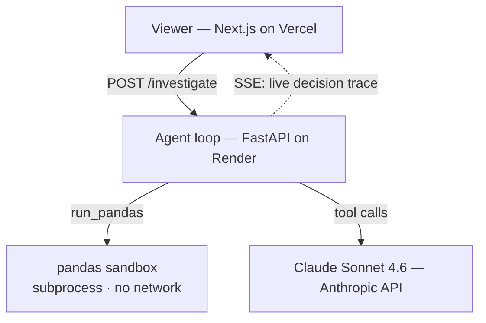

# Data Investigator


**An autonomous data-analysis agent that investigates a dataset the way a person would — one question at a time, deciding each step from what the last one revealed.**

🔗 **Live demo → https://web-mu-three-lu56la822j.vercel.app/investigator**

I built Data Investigator to show that I can build a *real* agent from the ground up — not a single prompt that returns an answer, and not a framework wrapper, but a hand-written loop where a language model writes its own pandas, runs it in a sandbox, reads the result, and decides its next move. You hand it a dataset and an investigative question like *"why did signups drop in March?"* and you **watch it think**: hypothesize → run code → read the result → follow the lead → fix its own broken query → stop when it actually has the answer.

**Nothing about the path is hardcoded. The data drives it.** The UI is built to make that visible: you see the tools the agent can call, the columns it's looking at, and every tool call streaming in as `calls run_pandas → input → returned`.

---

## The agent loop

The core is a hand-written `while` loop — deliberately not the SDK's tool-runner and not a managed-agent service, because the loop *is* the project and I wanted to own every line. Ask the model what to do, run whatever tool it asked for, feed the result back, repeat until it calls `finish`.


The only move I force is the very first one — `profile_data`, so the agent sees the real schema before it hypothesizes and never invents a column. After that, `tool_choice` is `auto` and the model is on its own. When a snippet throws, the sandbox hands the **verbatim traceback** back as a tool result with `is_error: true`, and the model reads it and rewrites — that's the self-correction. **Delete every `if step ==` line in the loop and it's still an agent**; those lines are only the first-step nudge and the safety caps.

---

## Anatomy of a run

An actual run on the demo dataset (*"why did signups drop in March?"*) — the reasoning path the agent chose entirely on its own:

```
① profile_data      → sees signup_date / campaign_id / activated are strings, 2,224 rows
② run_pandas        → monthly totals … ValueError: date "unknown" won't parse
   └─ self-corrects → re-runs with errors='coerce' → confirms the March dip
③ run_pandas        → signups by channel × month … only `social` collapses in March
④ run_pandas        → social by campaign_id … cmp_social_2024 is absent all March
⑤ run_pandas + bar  → weekly social signups, Feb vs Mar → chart shows a hard stop
⑥ finish            → "the social campaign was paused" — 6 findings, each grounded
```

It hit a broken date parse and fixed itself (②), branched from *total* → *channel* → *campaign* because each result pointed there, **chose** to draw a chart, and stopped once the causal chain held. A committed recording of this exact run replays on the live page even when the free backend is asleep.

---

## Architecture

Split hosting: a static viewer on Vercel, the CPU-bound agent + sandbox on an always-on Python host, the model behind an API.



The backend streams its **decision log** as step-level Server-Sent Events — the same stream the UI renders live and the thing I'd debug from. There's no separate logging pass; the trace *is* the log.

---

## Sandbox

- The agent's LLM-written pandas runs in an isolated, network-less, resource-limited subprocess, so untrusted code can never touch the server.

---

## Reliability & cost

- Runs on your own Anthropic API key.
- The public endpoint is rate-limited.

---

## Next steps

This is a single agent. The natural next step is to turn it into a small **orchestration** project — a coordinator that fans out several investigator agents and synthesizes their findings.

---

## Tech stack

- **Backend** — Python · FastAPI · Anthropic SDK (Claude Sonnet 4.6) · pandas. Deployed on Render.
- **Frontend** — Next.js · React · TypeScript. Deployed on Vercel.

---

## Run it locally

```bash
# Backend
cd agent
python3 -m venv .venv && source .venv/bin/activate
pip install -r requirements.txt
cp .env.example .env                # add your ANTHROPIC_API_KEY
python data/generate_signups.py     # (re)build the demo dataset
uvicorn app.main:app --reload

# Frontend (separate terminal)
cd web
npm install
cp .env.local.example .env.local    # NEXT_PUBLIC_BACKEND_URL=http://localhost:8000
npm run dev                          # → http://localhost:3000/investigator
```

Tests: `cd agent && python -m pytest` — sandbox isolation, the mocked agent loop, and the rate limiter.

---

## Project layout

```
agent/            Python backend
  app/loop.py       the hand-written agentic loop (the heart of it)
  app/tools.py      the 3 tool schemas the model sees
  app/sandbox.py    isolated pandas execution
  app/grounding.py  "no result, no claim"
  data/             the demo dataset + its seeder
web/              Next.js viewer
  lib/investigator/         events + reducer + the live/replay hook
  components/investigator/  the context panel, step cards, loop meter, report
  public/recordings/        the committed flawless run (demo insurance)
docs/             how-the-loop-works.md
```
